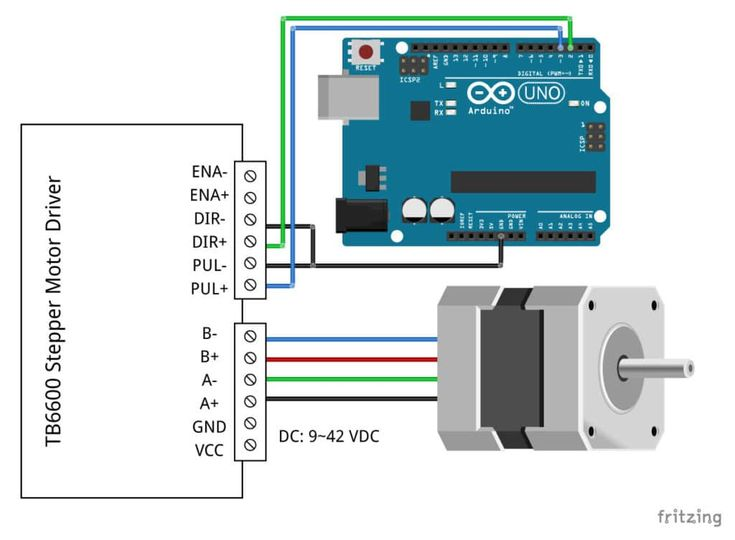

良好的学习资源：
[Stepper Motors and Arduino - The Ultimate Guide (howtomechatronics.com)](https://howtomechatronics.com/tutorials/arduino/stepper-motors-and-arduino-the-ultimate-guide/)
[How Stepper Motors Work](https://howtomechatronics.com/how-it-works/electrical-engineering/stepper-motor/)  
[认识步进驱动器 | 北岛夜话 (founderchip.com)](https://www.founderchip.com/?id=264)
模拟工具推荐：
https://www.tinkercad.com/
本博客创建为学习这个网站的笔记，并且转载该博客内容

## 自己的代码和实现的项目
<iframe src="//player.bilibili.com/player.html?aid=524566615&bvid=BV1zM411E7Ad&cid=1012231016&page=1" scrolling="no" border="0" frameborder="no" framespacing="0" allowfullscreen="true"> </iframe>

### 步进电机的基本原理
(参照 Dejan博客，收集与下文)

### 步进电机不同driver 的接线
[](https://howtomechatronics.com/wp-content/uploads/2022/05/A4988-and-Arduino-Connection-Wiring-Diagram.png)
A4988driver


TB6600


### Auto-immersion-lifter的实现

##### Aduino code:
~~~ c
#include <AccelStepper.h>

  

// Define the stepper motor and the pins that is connected to

AccelStepper stepper1(1, 3, 7); // (Typeof driver: with 2 pins, STEP, DIR)

  

void setup() {

Serial.begin(9600);

stepper1.setMaxSpeed(1000); // Set maximum speed value for the stepper

stepper1.setAcceleration(500); // Set acceleration value for the stepper

stepper1.setCurrentPosition(0); // Set the current position to 0 steps

}

  

void loop() {

if (Serial.available() > 0) {

String incomingString = Serial.readStringUntil('\n'); // Read until the "Enter" button is pressed

incomingString.trim(); // Remove leading/trailing whitespaces

if (incomingString == "lift") {

Serial.println("Enter number of steps to move:");

while (!Serial.available()); // Wait until a character is received

int stepsToMove = Serial.parseInt(); // Read an integer from the serial buffer

Serial.print("Moving UP by ");

Serial.print(stepsToMove);

Serial.println(" steps");

stepper1.moveTo(stepsToMove); // Set desired move: stepsToMove steps

stepper1.runToPosition(); // Moves the motor to target position

} else if (incomingString == "back") {

Serial.println("Moving back to original position");

stepper1.moveTo(0);

stepper1.runToPosition();

}

else if (incomingString == "set0"){

stepper1.setCurrentPosition(0);

}

}

}
~~~
这里需要提及的是：读取字符串的判断,第一版写法：
``` c
 if (Serial.available() > 0) {
    String incomingString = Serial.readString();
    if (incomingString == "lift") {
      Serial.println("Moving down 15000 steps");
      stepper1.moveTo(15000); // Set desired move: 15000 steps
      stepper1.runToPosition(); // Moves the motor to target position with acceleration/deceleration and blocks until it is in position
    }
```
可以成功读取，但是无法满足判断条件，怀疑是一起读取了'enter' '\n'于是使用chatgpt 检查并确认,同时向Chatgpt 学习数字的读取使用Serial.parseInt()


Q:Could it be also because I type the "enter" botton and it be count as part of the string?

>A :Yes, that could be the problem. When you type a string followed by the "Enter" button, the "Enter" button is also sent as a character to the serial buffer, which is then read by the `Serial.readString()` function as part of the string.

To solve this problem, you can use the `Serial.readStringUntil()` function instead of `Serial.readString()`. The `Serial.readStringUntil()` function reads the serial buffer until a specific character is encountered and then returns the received string.

Here's the modified code that uses `Serial.readStringUntil()` to read the input string until the "Enter" button is pressed:

``` c
#include <AccelStepper.h>

// Define the stepper motor and the pins that is connected to
AccelStepper stepper1(1, 3, 7); // (Typeof driver: with 2 pins, STEP, DIR)

void setup() {
  Serial.begin(9600);
  stepper1.setMaxSpeed(1000); // Set maximum speed value for the stepper
  stepper1.setAcceleration(500); // Set acceleration value for the stepper
  stepper1.setCurrentPosition(0); // Set the current position to 0 steps
}

void loop() {
  if (Serial.available() > 0) {
    String incomingString = Serial.readStringUntil('\n'); // Read until the "Enter" button is pressed
    incomingString.trim(); // Remove leading/trailing whitespaces
    if (incomingString == "lift") {
      Serial.println("Moving down");
      stepper1.moveTo(15000); // Set desired move: 15000 steps
      stepper1.runToPosition(); // Moves the motor to target position
    } else if (incomingString == "back") {
      Serial.println("Moving back to original position");
      stepper1.moveTo(0);
      stepper1.runToPosition();
    }
  }
}

```

The modified code reads the input string until the "Enter" button (`\n` character) is pressed and then removes the leading/trailing whitespaces using the `String.trim()` function.


>Sure! To add a function that allows you to enter the moving steps from Python, you can use the `Seri
>al.parseInt()` function to read an integer value from the serial buffer.


```c
scss#include <AccelStepper.h>

// Define the stepper motor and the pins that is connected to
AccelStepper stepper1(1, 3, 7); // (Typeof driver: with 2 pins, STEP, DIR)

void setup() {
  Serial.begin(9600);
  stepper1.setMaxSpeed(1000); // Set maximum speed value for the stepper
  stepper1.setAcceleration(500); // Set acceleration value for the stepper
  stepper1.setCurrentPosition(0); // Set the current position to 0 steps
}

void loop() {
  if (Serial.available() > 0) {
    String incomingString = Serial.readStringUntil('\n'); // Read until the "Enter" button is pressed
    incomingString.trim(); // Remove leading/trailing whitespaces
    if (incomingString == "lift") {
      Serial.println("Enter number of steps to move:");
      while (!Serial.available()); // Wait until a character is received
      int stepsToMove = Serial.parseInt(); // Read an integer from the serial buffer
      Serial.print("Moving down by ");
      Serial.print(stepsToMove);
      Serial.println(" steps");///same as.print
      stepper1.moveTo(stepsToMove); // Set desired move: stepsToMove steps
      stepper1.runToPosition(); // Moves the motor to target position
    } else if (incomingString == "back") {
      Serial.println("Moving back to original position");
      stepper1.moveTo(0);
      stepper1.runToPosition();
    }
  }
}

```

The modified code first waits for the "lift" command to be received, and then sends a prompt to enter the number of steps to move. It then waits for an integer value to be received from the serial buffer using the `Serial.parseInt()` function.

Once the number of steps is received, the motor is moved by the specified number of steps, and the action is confirmed with a message sent back to Python through the serial port.

##### PCB板控制端，给出串口，由python接管调用功能
~~~ python
ser = serial.Serial('/dev/cu.usbserial-14210', 9600)  
# wait for the Arduino to reset  
while(True):  
        inp = input('Choose the mode: ')  
        if inp == 'q':  
            break  
        elif inp == 'SI_tunning':  
            while True:  
                command = input('Input command: ')  
                if command =='quit':  
                    break # exit the SI mode loop and go back to the top-level loop  
                ser.write(str.encode(command))  
                line = ser.readline().decode().rstrip()  
                print(line)  
  
        elif inp =='Si_etching':  
            si_length = float(input('Si_length unit (um) '))  
            etching_speed =float(input('etching speed(um/min) '))  
            si_etching_control(si_length,etching_speed,12000)  
  
# close the serial connection  
ser.close()
~~~


字符串变 bytes
### Error:

raise TypeError('unicode strings are not supported, please encode to bytes: {!r}'.format(seq))
TypeError: unicode strings are not supported, please encode to bytes: 'lift\\n'

### Solution
~~~ python
command = input('input command')  
ser.write(str.encode(command))  
line = ser.readline()
~~~
使用 Str.encode()方法
或者{}.format


## What is a Stepper Motor and How It Works?

I will start with briefly explaining what is stepper motor and how it works, as it will help us better understand everything else in this tutorial. 

[](https://howtomechatronics.com/wp-content/uploads/2022/05/Inside-of-NEMA-17-Stepper-motor-How-It-Works.jpg)

A stepper motor is a unique type of brushless DC motor which position can be precisely controlled even without any feedback.

The working principle of a stepper motor is based on magnetic fields. It has two main components, a stator(定子) and a rotor（转子）. The rotor is usually a permanent magnet and it’s surrounded by some coils on the stator.

[](https://howtomechatronics.com/wp-content/uploads/2022/05/Stepper-Motor-main-components-stator-and-a-rotor.png)

When we energize or let current flow through the coils, particular magnetic fields are generated in the stator that either attract or repel the rotor. By activating the coils, step by step, one after another in a particular order, we can achieve continues motion of rotor, but also, we can make it stop at any position.

[](https://howtomechatronics.com/wp-content/uploads/2022/05/Stepper-Motor-Working-Principle.png)

So, that’s why these motors are called stepper motors, they move in discrete steps. 

By increasing the number of magnetic poles on the rotor, we can increase the number of possible stopping positions, thus increase the resolution or the precision of the motor. Please note that this is just a basic explanation and you can find more details in my [How Stepper Motors Work](https://howtomechatronics.com/how-it-works/electrical-engineering/stepper-motor/) tutorial. 

A typical stepper motor, a NEMA17 for example, has 50 stopping points or steps on the rotor. On the other hand, the stator can have several coils organized in two phases which provide four different magnetic field orientations or positions.

[](https://howtomechatronics.com/wp-content/uploads/2022/05/Stepper-motor-50-Steps-2-phases-and-4-different-magnetic-field-orientations-.png)

So, the 50 steps of the rotor multiplied by the 4 different magnetic field orientations, make total of 200 steps for completing a full rotation. Or if we divide 360 degrees by 200 steps, that’s a resolution of 1.8 degrees per step.

I mentioned that the stator coils are organized in two phases, and we can also notice that if we take a look at number of wires of a stepper motor. It has 4 four wires, two for each phase. The four different magnetic field orientations are possible as we can let current flow through the phases in both directions.

[](https://howtomechatronics.com/wp-content/uploads/2022/05/Current-flow-through-the-phases-stepper-motor-working-principle.jpg)

There also stepper motors with 5, 6 or even 8 wires, but they still work on two phases or we control them with just four terminals.

[](https://howtomechatronics.com/wp-content/uploads/2022/05/6-wire-and-8-wire-stepper-motor-connection-in-bi-polar-configuration.png)

The thing with them is that they can provide different performance characteristics, like more torque or more speed, depending on how we connect these wires on the four control terminals.

Nevertheless, with this brief explanation, now we understand that for driving a stepper motor, we cannot just connect power to it as nothing will happen. Instead, we have to energize the two motor phases in both directions, and activate or send pulses to them in particular order, in a timely sequence. So, that’s why we need drivers for controlling stepper motors. 

There are many types and sizes of drivers, corresponding to the many types and sizes of stepper motors. However, the basic working principle of all of them is that they have two H-Bridges that allow energizing the motor phases in both directions.

[](https://howtomechatronics.com/wp-content/uploads/2022/05/H-bridge-inside-a-stepper-motor-driver-how-it-works.png)

Of course, they have many other functions like micro stepping, current limiting, and so on that enable us to easily control the stepper motors, which is the whole purpose of them.

## How To Control NEMA17 Stepper Motor with Arduino and A4988 Stepper Driver

All right, now we can take a look at the first example for this tutorial, how to control a NEMA 17 stepper motor with an A4988 stepper driver. 

All right, now we can take a look at the first example for this tutorial, how to control a NEMA 17 stepper motor with an A4988 stepper drive.


The NEMA17 is the most popular stepper motor among makers, as it offers great performances and it’s affordable at the same time. It can be also found in almost any desktop 3D printer and laser engraver. 

Generally, the NEMA17 stepper motor has 200 steps, or 1.8 degrees per step resolution, but there are also models with 400 steps and 0.9 degrees per step resolution. We should note here that the designation NEMA17 actually describes just the size of the motor in terms of the front faceplate size.


The number stands for the size of faceplate in inches when divided by 10, or in this case that would be 17 divided by 10 equals 1.7 inches faceplate, or 2.3 inches faceplate in case of NEMA23.

So, the faceplate size is fixed, but the length of the NEMA17 steppers can vary from 20mm to 60mm, and with that the power requirement of the motor also varies. The power requirement is usually defined by how much current the motor is allowed to draw, and the range for these NEMA17 steppers motors is from 0.3A up to 2.5A.


Now, according to the current rating of the stepper motor, we need to choose a suitable driver which can handle that amount of current. The most popular driver controlling for NEMA17 stepper motors is the A4988 stepper motor driver.


The A4988 has a maximum current rating of 2A per coil, but that’s actually a peak rating. It is recommended to keep the current to around 1A, but of course, it is also possible to go up to 2A of good cooling is provided to the IC. 

A great feature the A4988 stepper driver has, actually all other drives have, is the current limiting. With this we can easily set how much current the motor will draw no matter the motor rating. For example, we can connect even a 2.5A rated stepper motor, but we will limit the current of the driver to 1.5A. So, although the motor won’t work at its maximum capacity, we would still be able to use it.

On the other hand, if the motor is rated lower than the set current limit on the driver, the motor would overheat. Of course, it’s always recommended to try to match the current rating of the motor with the current rating of the driver.

### A4988 and Arduino Connection

All right, so now let’s see how to connect the A4988 driver with the stepper motor and the Arduino controller.

[](https://howtomechatronics.com/wp-content/uploads/2022/05/A4988-and-Arduino-Connection-Wiring-Diagram.png)

At top right corner of the driver we have the VMOT and GND pins and here we connect the power supply for the motor which can range 8 to 36V. Here it is also recommended to use a decoupling capacitor across these two pins in order to protect the board from voltage spikes. We should use large electrolytic capacitor with at least 47uF capacity. 

Next, are the four pins where we connect the stepper motor. One phase of the motor goes on 1A and 1B pins, and the other phase on 2A and 2B pins. 

Sometimes, it can be a bit difficult to recognize which two wires of the motor make a phase, but are several ways to identify them. The simplest way is to rotate the shaft of the stepper motor by hand, and then connect two wires to each other. If you connect two wires that make a phase, the rotation of the shaft would be a bit more difficult.


Another way is to use a multimeter and check for continuity between the two wires. If you connect two wires that make a phase, you will have a short circuit and the multimeter will start beeping.

[](https://howtomechatronics.com/wp-content/uploads/2022/05/How-to-find-the-phase-of-a-stepper-motor-which-wires-make-a-phase.jpg)

Once we find a phase, we can connect it to any position of the two positions on the driver, the order doesn’t matter. 

Next, we have the IC or the logic power supply pins, VDD and GND, which can be from 3V to 5V. On the other side we have the Step and the Direction pins, which can be connected to any pin of the Arduino board. With the Direction pin we select the rotation direction of the motor, and with the Step pin we control to steps of the motor. With each pulse we send to the Step pin, the motor will advance one step in the selected direction. 

Right above these pins, we have the Sleep and the Reset pins which are used for, as their names suggest, putting the driver to sleep mode or resetting it. We should note that both of these pins are active low. The Sleep pin by default is HIGH state, but the RST pin is floating. That means in order to have the driver enabled, the easiest way is to just connect these two pins to each other, assuming we won’t use these pins functions. 

The Enable pin is also active low, so unless we pull it HIGH, the driver will be enabled. 

The next three pins, MS1, MS2 and MS3, are for selecting the step resolution of the motor. We already said that the step resolution depends on the construction of the motor which is usually 200 steps per revolution for a NEMA 17 stepper motor. However, all stepper drivers have this feature called microstepping which allows driving the motor at higher resolutions. This is achieved by energizing the coils at an intermediate current level, which produce intermediate step locations.

[](https://howtomechatronics.com/wp-content/uploads/2022/05/Steppers-control-with-Microstepping-intermediate-current-levels-on-the-motors-coils.png)

For example, if we select quarter-step resolution, the 200 steps of the motor will become, 200 multiplied by 4 equals 800 microsteps per revolution. The driver will use four different current levels on the coils to achieve this. 

The A4988 driver has a maximum resolution of 16 microsteps, which would make a 200 steps NEMA17 motor has 3200 steps per revolution, or that’s 0.1125 degrees per step. That’s really impressive precision and that’s why these types of stepper motors and drivers are used in so many applications. Actually, there are stepper drivers that have up 256 microsteps, or that’s a whopping 51200 steps per revolution, or 0.007 degrees per step.

Nevertheless, these three pins have pull-down resistors, so if we leave them disconnected, the driver will work in full-step mode. For selecting a different mircrostepping resolution we need to connect 5V to the appropriate pins according to this table. 

### A4988 Current Limiting

All right, so now that we know how to connect the stepper motor and the driver to the Arduino board, we can move on with explaining how to program or code the Arduino for controlling the stepper. However, before we do that, or before we power the motor, there is one more very important thing that we need to do, and that’s to adjust the current limit of the driver.

As we already explained, we need to adjust the current limit of the driver to be lower than the current rating of the motor, or otherwise the motor would overheat.

[](https://howtomechatronics.com/wp-content/uploads/2022/05/Setting-the-A4988-current-limit-by-measuring-the-reference-voltage.jpg)

There’s a small trimmer potentiometer on the A4988 driver though which we can adjust the current limit. By rotating the potentiometer clockwise, the current limit raises, and vice versa. There are two methods which can be used for determining the actual value of the current limit. 

The first method involves measuring the reference voltage across the potentiometer itself and GND. We can measure the reference voltage using a multimeter, and use that value in the following formula to calculate the current limit of the driver:

**_Current Limit = Vref / (8 x Rcs)_**

The Rcs is the current sense resistance or the values of the current sensing resistors located right next to the chip. Depending on the manufacturer, these values are usually 0.05, 0.1 or 0.2 ohms. So, we need to take a closer look at the value of these resistors in order to accurately calculate the current limit with this method. In my case, these resistors were labeled R100, which meant 0.1ohms.

[](https://howtomechatronics.com/wp-content/uploads/2022/05/A4988-stepper-driver-current-sensing-resistors-for-calculating-the-current-limit-using-the-voltage-reference.jpg)

As an example, if we measure a reference voltage of 0.7V, and we have 0.1 ohms resistors, the current limit would be a 0.875A. Or if we want to limit the current to, let’s say 1A, we should adjust the reference voltage to 0.8V. 

The second method for setting the current limit is by directly measure the current through the coils. For that purpose, we need to connect the stepper motor and the driver as explained previously. We can skip the controller connection, but instead connect 5V to the Direction and the Step pins so that the motor stays active and holds one position. The MS pins should be left disconnected so the driver would work in full-step mode. Then we can disconnect one line or coil from the motor, and connect it in series with an ammeter. In this way, once we power the driver with both the logic voltage, the 5V, and the power for the motor 12V in my case, we can read how much current is running through the coil.


Though, we should note here that when the driver works in full-step mode, the current in the coils can reach only 70% of the actually current limit. So, when using the driver in the other microstepping modes, the reading from the ammeter should be multiplied by 1.3 in order to get the actual value of the current limit of the driver. 

I tried both methods for setting up the current limit of the driver and they gave me approximately the same results.

## Stepper Motors and Arduino – Example Codes

Nevertheless, now we can move on with programming the Arduino, or take a look at several example codes for controlling a stepper motor with an Arduino board.


Let’s start with a very basic example code of how to control a stepper motor without using a library.

**Example code 1**

```
/*   
 *   Basic example code for controlling a stepper without library
 *      
 *   by Dejan, https://howtomechatronics.com
 */

// defines pins
#define stepPin 2
#define dirPin 5 
 
void setup() {
  // Sets the two pins as Outputs
  pinMode(stepPin,OUTPUT); 
  pinMode(dirPin,OUTPUT);
}
void loop() {
  digitalWrite(dirPin,HIGH); // Enables the motor to move in a particular direction
  // Makes 200 pulses for making one full cycle rotation
  for(int x = 0; x < 800; x++) {
    digitalWrite(stepPin,HIGH); 
    delayMicroseconds(700);    // by changing this time delay between the steps we can change the rotation speed
    digitalWrite(stepPin,LOW); 
    delayMicroseconds(700); 
  }
  delay(1000); // One second delay
  
  digitalWrite(dirPin,LOW); //Changes the rotations direction
  // Makes 400 pulses for making two full cycle rotation
  for(int x = 0; x < 1600; x++) {
    digitalWrite(stepPin,HIGH);
    delayMicroseconds(500);
    digitalWrite(stepPin,LOW);
    delayMicroseconds(500);
  }
  delay(1000);
}Code language: Arduino (arduino)
```

**Code description:**

Here all we have to do is define to which pin number the STEP and DIR pins are connected and define them as outputs. In the loop, first we set the rotation direction of the motor by making the Direction pin status HIGH. Then using a “for” loop we send 200 pulses to the STEP pin which will make the motor rotate a full cycle, considering that it works in full-step mode. The pulses are generated simply by toggling the state of the STEP pin HIGH to LOW with some time delay between them. This time delay actually defines the speed of rotation. If we lower it, the speed of rotation will increase as the steps will occur faster, and vice versa. 

Then we change the rotation direction, and using another “for” loop we send 400 pulses which would make to motor rotate two full cycles. However, if we change the microstepping mode of the driver, let’s say so a quarter-step, which would make the motor have 800 steps now, the first loop will make the motor rotate only 90 degrees, and the second loop only half rotation.

**Example code 2**

Here’s another simple example, controlling the stepper motor speed using a potentiometer.

[](https://howtomechatronics.com/wp-content/uploads/2022/05/Controlling-stepper-motor-speed-with-potentiometer-Wiring-diagram.png)

For that purpose, just have to connect the potentiometer to the Arduino and read its value using the analogRead() function.

```
/*
     Basic example code for controlling a stepper without library

     by Dejan, https://howtomechatronics.com
*/

// defines pins
#define stepPin 2
#define dirPin 5

int customDelay, customDelayMapped;

void setup() {
  // Sets the two pins as Outputs
  pinMode(stepPin, OUTPUT);
  pinMode(dirPin, OUTPUT);
}
void loop() {
  speedControl();
  // Makes pules with custom delay, depending on the Potentiometer, from which the speed of the motor depends
  digitalWrite(stepPin, HIGH);
  delayMicroseconds(customDelayMapped);
  digitalWrite(stepPin, LOW);
  delayMicroseconds(customDelayMapped);
}
// Custom function for reading the potentiometer and mapping its value from 300 to 3000, suitable for the custom delay value in microseconds
void speedControl() {
  customDelay = analogRead(A0); // Read the potentiometer value
  customDelayMapped = map(customDelay, 0, 1023, 300, 3000); // Convert the analog input from 0 to 1024, to 300 to 3000
}Code language: Arduino (arduino)
```

**Code description:**

We can then map or convert the potentiometer values which are from 0 to 1023, to values suitable for being a delay time in microseconds for the Step pulses. I found the minimum value for the delay between steps to be around 300 microseconds. By going lower that that the stepper motor started skipping steps. 

Overall, controlling stepper motors with this method is easy and it works, but only if the required control is simple as shown in the examples. In case we need more complex control, the best way is to use an Arduino library.

## Controlling Stepper Motors with Arduino and the AccelStepper Library – Examples

The most popular library for controlling stepper motors with Arduino is the [AccelStepper library by Mike McCauley](https://www.airspayce.com/mikem/arduino/AccelStepper/). It’s an extremely versatile library featuring speed, acceleration and deceleration control, setting target positions, controlling multiple stepper motors simultaneously and so on.

The library has a great documentation explaining how each function work. I have already used this library for several of my Arduino projects, for controlling the motion of my [DIY Camera Slider](https://howtomechatronics.com/tutorials/arduino/diy-motorized-camera-slider-pan-tilt-head-project/), the [3D wire bending machine](https://howtomechatronics.com/projects/arduino-3d-wire-bending-machine/), the [SCARA robot arm](https://howtomechatronics.com/projects/scara-robot-how-to-build-your-own-arduino-based-robot/) and few others. In case you are interested, there are details and code explanations for each project on the website. 

Now let’s take a look at few examples code using this library.

### Example code – Stepper motor speed control using a potentiometer

The first example will be controlling the speed of the motor using the potentiometer.

```
/*   
 *   Basic example code for controlling a stepper with the AccelStepper library
 *      
 *   by Dejan, https://howtomechatronics.com
 */

#include <AccelStepper.h>

// Define the stepper motor and the pins that is connected to
AccelStepper stepper1(1, 2, 5); // (Type of driver: with 2 pins, STEP, DIR)

void setup() {
  // Set maximum speed value for the stepper
  stepper1.setMaxSpeed(1000);
}

void loop() {
  stepper1.setSpeed((analogRead(A0));
  // Step the motor with a constant speed previously set by setSpeed();
  stepper1.runSpeed();
}Code language: Arduino (arduino)
```

**Code description:**

So, here first we need to include the AccelStepper library. Of course, before we do that, we need to install the library and we can do that from the Arduino IDE library manager. We just have to search “AccelStepper” and the library will show up and we can install it. 

Then, we need to create an instance of the AccelStepper class for our motor. The first parameter here is the type of driver, in this case for a driver with two control pins this value is 1, and the other two parameters are the pin numbers to which our driver is connect to the Arduino. If we have multiple stepper motors, we need to define each of them like this, and we can name them however we want, in this case I named my motor stepper1. 

In the setup section we just have to set the maximum speed of the motor which is defined as steps per second. This value can go up to 4000, but in the documentation of the library it is stated that speed values of more than 1000 steps per seconds might be unreliable. 

In the loop section, using the setSpeed() function we set the current speed of the motor, and in this case that’s the analog input from the potentiometer which is from 0 to 1023.

In order the motor to move and implement that constant speed, we need to call the runSpeed() function each interval. A negative value here, or simply including a minus sign before the value, would make the stepper motor rotate in the opposite direction.

### Example code – Controlling two stepper motors with acceleration and deceleration


Here’s another example of controlling two stepper motors with implementing acceleration and deceleration using the AccelStepper library.

```
/*
    Controlling two stepper with the AccelStepper library

     by Dejan, https://howtomechatronics.com
*/

#include <AccelStepper.h>

// Define the stepper motor and the pins that is connected to
AccelStepper stepper1(1, 2, 5); // (Typeof driver: with 2 pins, STEP, DIR)
AccelStepper stepper2(1, 3, 6);

void setup() {

  stepper1.setMaxSpeed(1000); // Set maximum speed value for the stepper
  stepper1.setAcceleration(500); // Set acceleration value for the stepper
  stepper1.setCurrentPosition(0); // Set the current position to 0 steps

  stepper2.setMaxSpeed(1000);
  stepper2.setAcceleration(500);
  stepper2.setCurrentPosition(0);
}

void loop() {

  stepper1.moveTo(800); // Set desired move: 800 steps (in quater-step resolution that's one rotation)
  stepper1.runToPosition(); // Moves the motor to target position w/ acceleration/ deceleration and it blocks until is in position

  stepper2.moveTo(1600);
  stepper2.runToPosition();

  // Move back to position 0, using run() which is non-blocking - both motors will move at the same time
  stepper1.moveTo(0);
  stepper2.moveTo(0);
  while (stepper1.currentPosition() != 0 || stepper2.currentPosition() != 0) {
    stepper1.run();  // Move or step the motor implementing accelerations and decelerations to achieve the target position. Non-blocking function
    stepper2.run();
    //
    //
  }
}Code language: Arduino (arduino)
```

**Code description:**

So, we need to define the two stepper motors, and in the setup, using the setAcceleration() function set the acceleration value for the motors. Using the setCurrentPosition() function we set the position of the motors to be at 0 steps. 

In the loop section, we start with the moveTo() function through which we tell the motor to what position to go or how many steps it should move. In case of quarter-step resolution, 800 steps would mean one full rotation. Then, the runToPosition() function moves the motor to that position while implementing acceleration and deceleration. However, this is a blocking function, so the code execution will stay there until the stepper motor reaches that position. 

With the same method we move the second motor 1600 steps or two full rotations with quarter-step resolution. 

If we don’t want our code to be blocked until the motor reach the target position, instead of using the runToPosition() function, we should use the run() function. The run() also implements acceleration and deceleration to achieve the target position, but it just makes one step per call. Therefore, we need to call it as frequently as possible. For that reason, here we put the run() functions for both motors in this while loop, which is executed until both steppers reach position 0. We previously set the two motors to go to position 0 with the moveTo() functions. 

We could also add more code in that “while” loop and do other stuff too along running the motor. Actually, there are many methods of running the motors and doing other stuff too. I recommend going through the nicely described documentation of the library so you can understand how each function works and implement them according to your needs.

### Example code – Controlling multiple stepper motors with AccelStepper library

I would like to show you one more example using the AccelStepper library and that’s controlling multiple stepper motors in a coordinated fashion. This means, we can set target positions for each stepper and they can reach their positions all at the same time, no matter the different distance they need to travel.

[](https://howtomechatronics.com/wp-content/uploads/2022/05/Controlling-multiple-stepper-motors-with-AccelStepper-library.jpg)

This can be easily done using the MultiStepper class that comes with the AccelStepper library.

```
/*
    Controlling multiple steppers with the AccelStepper and MultiStepper library

     by Dejan, https://howtomechatronics.com
*/

#include <AccelStepper.h>
#include <MultiStepper.h>

// Define the stepper motor and the pins that is connected to
AccelStepper stepper1(1, 2, 5); // (Typeof driver: with 2 pins, STEP, DIR)
AccelStepper stepper2(1, 3, 6);
AccelStepper stepper3(1, 4, 7);

MultiStepper steppersControl;  // Create instance of MultiStepper

long gotoposition[3]; // An array to store the target positions for each stepper motor

void setup() {

  stepper1.setMaxSpeed(1000); // Set maximum speed value for the stepper
  stepper2.setMaxSpeed(1000);
  stepper3.setMaxSpeed(1000);

  // Adding the 3 steppers to the steppersControl instance for multi stepper control
  steppersControl.addStepper(stepper1);
  steppersControl.addStepper(stepper2);
  steppersControl.addStepper(stepper3);
}

void loop() {
  // Store the target positions in the "gotopostion" array
  gotoposition[0] = 800;  // 800 steps - full rotation with quater-step resolution
  gotoposition[1] = 1600;
  gotoposition[2] = 3200;

  steppersControl.moveTo(gotoposition); // Calculates the required speed for all motors
  steppersControl.runSpeedToPosition(); // Blocks until all steppers are in position

  delay(1000);

  gotoposition[0] = 0;
  gotoposition[1] = 0;
  gotoposition[2] = 0;

  steppersControl.moveTo(gotoposition);
  steppersControl.runSpeedToPosition();

  delay(1000);
}Code language: Arduino (arduino)
```

**Code description:**

Here we also need to include the MultiStepper class, and create an instance of it. Then we need to define an array, type “long”, which will be used for storing the target positions for our motors. In the setup section, we need to define the maximum speed values of the steppers and add the steppers to the previously created MultiStepper instance, which in my case I named it “steppersControl”. 

In the loop section, we start by storing the target position values in the array that we previously created. I set the first stepper to move one rotation, the second, two rotations and the third one, three rotations. Then we can assign this array to the moveTo() function which will calculate the required speeds for all motors to arrive at those positions at the same time. Then we just have to call the runSpeedToPosition() function which will move the motors to their position. Though we should note that this function blocks the code until the steppers reach their target position. We could use the run() function instead, if we don’t want to block the code. We should also note that the MultiStepper class doesn’t support acceleration and deceleration. 

Nevertheless, if you want to learn more, from more advanced examples, you can check my Arduino projects that I already mentioned, all the details and the codes for them are on the website.

## CNC shield for controlling multiple stepper motors for any Arduino project

Still taking about controlling multiple stepper motors, it’s worth mentioning and taking a look at the Arduino CNC shield.

[](https://howtomechatronics.com/wp-content/uploads/2022/05/CNC-Shield-for-controlling-multiple-stepper-motors-for-any-Arduino-project.jpg)

The main purpose of the Arduino CNC shield is for controlling 2 or 3-axis CNC machines, but it is actually a great option for controlling any type of project where we need to control multiple stepper motors as it is compact and provides easy connections for the drivers and the motors. 

This shield goes on top of an Arduino UNO board, and can control up to 4 individual stepper motors, and have all the remaining Arduino pins available for use. I used this combination of an Arduino UNO board and the CNC shield for controlling my [4-axis SCARA robot arm](https://howtomechatronics.com/projects/scara-robot-how-to-build-your-own-arduino-based-robot/).

I will update this section of the article, how to use the CNC shield with Arduino with more details soon.

## DRV8825 vs A4988

All right, so now let’s move on and see how we can control stepper motors using the other driver that I mentioned at the beginning, the DRV8825.

Actually, everything we explained so far about controlling stepper motors with the A4988 stepper driver, applies for the DRV8825 as well. The working principle, the connections and the coding are almost the same for both of these drivers. The difference between them is in their technical characteristics and now we will take a look at them and compare them.

[](https://howtomechatronics.com/wp-content/uploads/2022/05/DRV8825-vs-A4988-stepper-drivers.jpg)

The DRV8825 is a stepper driver by Texas Instruments which can be used as direct replacement for the Allegro A4988 driver as their connections are the same. The three key differences between them are that the DR8825 can deliver more current than the A4988 without additional cooling (1.5A vs 1A), it has higher maximum supply voltage (45V vs 35V), and it offers higher microstepping resolution (32 vs 16 microsteps). 

Of course, they also have some other minor differences. For example, the current limit potentiometer has a different location and the relationship between the current limit setting and the reference pin voltage is different. The DRV8825 doesn’t need logic power supply, and the that pin location is used as FAULT output.

[](https://howtomechatronics.com/wp-content/uploads/2022/05/DRV8825-vs-A4988-pinout.png)

However, it is safe to connect the FAULT pin directly to 5V, so the DRV8825 can be used as a direct replacement in systems designed for the A4988 driver. 

It’s worth noting though, that when replacing an A4988 driver with an DRV8825 it is very important to make sure the orientation of the driver is correct. I already mentioned, their potentiometers are at different locations, on the A4988 it’s below the chip, and on the DRV8825 is above the chip, and that can sometimes cause confusion and the driver can be easily placed on the wrong side. 

For setting the current limit, we can measure the reference voltage with one probe on GND and the other on the potentiometer itself.

[](https://howtomechatronics.com/wp-content/uploads/2022/05/Adjusting-the-current-limit-of-the-DRV8825-stepper-driver.jpg)

The formula for calculating for the DRV8825 stepper drive is as follow:

**_Current limit = Vref x 2_**

As for selecting the microstepping resolution, we can use the following table.


Overall, the DRV8825 is a better stepper driver than the A4988, as it offers higher current and voltage ratings, and higher microstepping resolution which results in smoother and quieter operation of the stepper motor.

## TMC2208 Stepper Driver

Speaking of smoother and quieter operation, let’s take a look at the TMC2208 stepper driver. The TMC2208 chip is made by Trinamic, a Germany based company specialized in motion control electronics. The TMC2208 is a silent stepper motor driver which can be also used as a direct replacement in systems designed for the A4988 or the DRV8825 drivers. It is widely used in desktop 3D printers, laser engravers, scanners and so on.

[](https://howtomechatronics.com/wp-content/uploads/2022/05/TMC2208-vs-A4988-vs-DRV8825-stepper-motor-drivers.jpg)

What sets this driver apart from the two others is its integrated interpolation unit which provides 256 subdivisions or microsteps. This allows for perfect sinusoidal control which is generated internally within the chip. This means that the driver will output 256 microsteps to the stepper motor, no matter what microstep resolution we have selected through the two MS pins, 2, 4, 8 or 16 microsteps. This provides smoother operation and reduces the burden of the microcontroller significantly.

[](https://howtomechatronics.com/wp-content/uploads/2022/05/TMC2208-256-subdivisions-or-microsteps-with-integrated-interpolation-from-2-4-8-or-16-microsteps.jpg)

This feature of the driver, in combination with the its noiseless current control StealthChop2 technology, provide that ultra-silent control of the stepper motors. Here’s a comparison of the noise levels between the three drivers.

[](https://howtomechatronics.com/wp-content/uploads/2022/05/TMC2208-vs-A4988-vs-DRV8825-Noise-Levels-Comparison.jpg)

**Stepper driver noise levels:** A4988 around 65dB, DRV8825 around 67dB and TMC2208 around 41dB.

The TMC2208 drives the stepper motors completely silently, which is really impressive.

The current rating of the TMC2208 is slightly higher than the A4988 driver, or it’s 1.2A with 2A peak current. For setting the current limit of the driver, again we can use the same method as explained for the other drivers. We need to measure the reference voltage with one probe on GND, and other on the whole right next to the Enable pin.

[](https://howtomechatronics.com/wp-content/uploads/2022/05/TMC2208-current-limiting-by-measuring-the-reference-voltage.png)

The formula for calculating the current limit is as follow:

**_Current limit = Vref x 0.71_**

Although it can be used as direct replacement, the TMC2208 driver has a slightly different pinout compared to the A4988 driver. Here we only have two pins for selecting the microsteps resolution and for enabling the driver we need to connect the Enable pin to GND.

[](https://howtomechatronics.com/wp-content/uploads/2022/05/TMC2208-and-Arduino-Connection-Wiring-diagram-and-microstepping-table.png)

In terms of coding, it’s the same as the other two drivers. 

The TMC2208 driver also have some other, more advanced features compared to the two other drivers, like for example, a simple-to-use UART interface which provides controlling the driver with just a single line, instead of the two Step and Dir pins. In addition to that I provides more tuning and control options. 

Overall, the TMC2208 is a better driver that the A4988 and the DRV8825, but that’s normal as it comes with a higher price tag. Though, if you don’t need these extra features and the noise levels doesn’t concern you, are other two drivers are just great choice.

### 2、步进驱动器的接线及设置

目前市场上有很多步进驱动器，各厂家的驱动器具有类似的接口，都有信号、电源、电机等接线端子；有输出电流及细分驱动设置的拨码开关。本节以雷赛科技（LeadShine）的DM542步进驱动器为例，介绍下步进驱动器的接线及设置。

DM542是雷赛公司推出的两相步进电机驱动器，采用脉冲方式进行控制，支持8档位电流及16档位细分驱动；输入电压范围：DC 20V~50V，输出峰值电流范围：1.0~4.2A；下面这张图是DM542的外观图：


从图片中可以看出，DM542步进驱动器包括控制信号端子、电源端子、电机接线端子、输出电流设置和细分驱动设置拨码开关等几部分组成。

**2.1、控制信号端子**

控制信号端子与PLC、单片机或其它控制器相连接，用来接收控制器发出的脉冲、方向及使能控制信号。

2.1.1、脉冲信号（Pulse）

脉冲信号有两个接线端子：PUL+和PUL-。"PUL+"连接脉冲信号正极，“PUL-”连接脉冲信号负极；脉冲信号以"PUL+"与"PUL-"的电压差来衡量；拨码开关SW13可设置脉冲的有效沿，默认（SW13=OFF）上升沿有效；

2.1.2、方向信号（Direction）

方向信号有两个接线端子：DIR+和DIR-。"DIR+"连接方向信号正极，"DIR-"连接方向信号负极；步进电机的初始运行方向与电机绕组的接线有关，任何一组绕组互换（比如：A+和A-互换）都能改变电机的初始运行方向；电机在运行过程中的方向改变可以通过方向信号来控制，为了保证步进电机可靠换向，方向信号应早于脉冲信号至少5us建立；

2.1.3、使能信号（Enable）

使能信号用于使能或禁止驱动器输出，有两个接线端子：ENA+和ENA-。"ENA+"连接使能信号正极，"ENA-"连接使能信号负极；当"ENA+"信号接通时，驱动器将切断步进电机各相电源而使其处于自由状态，该状态不响应脉冲信号；

注：脉冲信号、方向信号和使能信号输入电压值的大小可通过滑动开关来设置，有DC 5V和DC 24V两种选择，出厂默认DC 24V；

2.1.4、报警信号（Alarm）

驱动器故障信号输出，用于连接到PLC/控制器的输入通道。出厂默认正常情况下ALM和COM是导通状态，当驱动器报警时为截止状态；可通过拨码开关SW12设置；

2.1.4、抱闸信号（Brake）：步进电机的抱闸信号输入；

2.1.5、COM：报警信号和抱闸信号的公共端；

**2.2、电源接口**

电源接口包括2个接线端子：+Vdc、GND，其中：

+Vdc：直流电源正极，电压范围：+20V~+50V，推荐+24V~+48V；

GND：直流电源负极；

**2.3、电机接线端子**

电机接线端子包括：A+、A-、B+、B-，其中：

A+和A-是步进电机的A相绕组的两个接线柱；

B+和B-是步进电机的B相绕组的两个接线柱；

下面这张图是步进电机驱动器的接线图：


### **2.4、步进电机的电流设置**

DM542步进驱动器的中间有8个拨码开关（SW1~SW8），其中SW1~SW3用来设置工作电流（动态电流）；SW4用来设置静止电流（静态电流）；SW5~SW8是细分设置（将在第3小节详细介绍）；

**2.4.1、工作电流设置**

通过设置步进驱动器的电流输出拨码开关，可以改变驱动器的输出电流大小。DM542的SW1~SW3拨码开关设置如下图所示：


当步进驱动器设置的输出电流越大时，其连接的步进电机的输出力矩就越大。但是电流过大会导致电机和驱动器发热，严重时可能会损坏电机或驱动器。因此在设置步进驱动器的电流时建议遵循如下原则：

-   四线电机：设置输出电流等于或略小于电机的额定电流；
    
-   六线电机高力矩模式：设置输出电流等于电机单极性接法额定电流的50%；
    
-   六线电机高速模式：设置输出电流等于电机单极性接法额定电流的100%；
    

举个例子：假设要用DM542驱动雷赛42CM06步进电机，该电机的额定电流为2.5A，我们就采用输出均值电流2.36A的档位，设置SW1=OFF，SW2=ON，SW3=OFF；

另外要注意：步进电机的运动类型及停留时间的长短，都会影响其发热量。因此在实际使用中应视电机的发热情况适当调节输出电流的大小。原则上如果电机运行15~30分钟后如果表面温度低于40度，可适当增加电流设置值以增大输出扭矩；但如果温升太高（>70度），则应降低电流的设置值；

**2.4.2、静止电流设置**

拨码开关SW4可用于设置步进电机在静止状态时驱动器的输出电流。默认情况下SW4=OFF，它表示驱动器在没有接收到脉冲0.4秒后，将输出电流改变为峰值电流的50%，这样可以降低驱动器和电机的发热；如果将SW4设置为ON，则电机在静止状态下，驱动器的输出电流为其峰值电流的90%；

### 3、细分驱动设置

**3.1、什么是细分驱动？**

步进电机在出厂时都标注了“固有步距角”。比如某电机的固有步距角为0.9度/1.8度，表示电机半步工作每次会转过0.9度，整步1.8度。在很多精密控制的场合，固有步距角不能满足控制精度的要求，人们希望能将一个固有步距角分很多步来走完。这种将固有步距角再分成很多步的驱动方法，称为"细分驱动"。能实现细分驱动的驱动器，称为"细分驱动器"。

**3.2、细分驱动的优点**

-   细分驱动将固有步距角平均分成几份，减少了每步的步距角的大小，提高了步距均匀度，提高了控制精度；
    
-   低频振荡是步进电机的固有特性，细分驱动提高了电机的转动频率，可以降低电机的振动；
    
-   细分驱动可以有效减少转矩波动，提高输出转矩；
    

**3.4、细分驱动的设置**

以DM542为例，该驱动器提供了四个拨码开关（SW5~SW8）用来设置细分驱动，如下图所示：


假设我们要把电机设置为3200步/转（即每转一圈需要3200个脉冲信号），则拨码开关设置如下：SW5=ON，SW6=ON，SW7=OFF，SW8=ON  

~~~ C
#include <AccelStepper.h>

// Define the stepper motor and the pins that is connected to
AccelStepper stepper1(1, 3, 7); // (Typeof driver: with 2 pins, STEP, DIR)

void setup() {
  Serial.begin(9600);
  stepper1.setMaxSpeed(1000); // Set maximum speed value for the stepper
  stepper1.setAcceleration(500); // Set acceleration value for the stepper
  stepper1.setCurrentPosition(0); // Set the current position to 0 steps
}

void loop() {
  if (Serial.available() > 0) {
    String incomingString = Serial.readStringUntil('\n'); // Read until the "Enter" button is pressed
    incomingString.trim(); // Remove leading/trailing whitespaces
    if (incomingString == "lift") {
      Serial.println("Moving down");
      stepper1.moveTo(15000); // Set desired move: 15000 steps
      stepper1.runToPosition(); // Moves the motor to target position
    } else if (incomingString == "back") {
      Serial.println("Moving back to original position");
      stepper1.moveTo(0);
      stepper1.runToPosition();
    }
  }
}

~~~


# How the Stepper Motor work 步进电机工作原理
In this tutorial article you will learn how a stepper motor works. We will cover the basic working principles of stepper motors, their driving modes and the steppers types by construction. You can watch the following video or read the written article.

  

## Working Principle

Stepper motor is a brushless DC motor that rotates in steps. This is very useful because it can be precisely positioned without any feedback sensor, which represents an open-loop controller. The stepper motor consists of a rotor that is generally a permanent magnet and it is surrounded by the windings of the stator. As we activate the windings step by step in a particular order and let a current flow through them they will magnetize the stator and make electromagnetic poles respectively that will cause propulsion to the motor. So that’ the basic working principle of the stepper motors.

### 

## Driving Modes

There are several different ways of driving the stepper motor. The first one is the Wave Drive or Single-Coil Excitation. In this mode we active just one coil at a time which means that for this example of motor with 4 coils, the rotor will make full cycle in 4 steps.


Next is the Full step drive mode which provides much higher torque output because we always have 2 active coils at a given time. However this doesn’t improve the resolution of the stepper and again the rotor will make a full cycle in 4 steps.


For increasing the resolution of the stepper we use the Half Step Drive mode. This mode is actually a combination of the previous two modes.

Here we have one active coil followed by 2 active coils and then again one active coil followed by 2 active coils and so on. So with this mode we get double the resolution with the same construction. Now the rotor will make full cycle in 8 steps.


However the most common method of [controlling stepper motors](https://howtomechatronics.com/tutorials/arduino/how-to-control-stepper-motor-with-a4988-driver-and-arduino/) nowadays is the Microstepping. In this mode we provide variable controlled current to the coils in form of sin wave. This will provide smooth motion of the rotor, decrease the stress of the parts and increase the accuracy of the stepper motor.


Another way of increasing the resolution of the stepper motor is by increasing the numbers of the poles of the rotor and the numbers of the pole of the stator.


## Stepper Motor Types by Construction


By construction there are 3 different types of stepper motors: permanent magnet stepper, variable reluctance stepper and hybrid synchronous stepper motor.  

The **Permanent Magnet** stepper has a permanent magnet rotor which is driven by the stators windings. They create opposite polarity poles compared to the poles of the rotor which propels the rotor.


The next type, the **Variable Reluctant** stepper motor uses a non-magnetizes soft iron rotor. The rotor has teeth that are offset from the stator and as we active the windings in a particular order the rotor moves respectively so that it has minimum gab between the stator and the teeth of the rotor


The **Hybrid Synchronous** motor is combinations of the previous two steppers. It has permanent magnet toothed rotor and also a toothed stator. The rotor has two sections, which are opposite in polarity and their teeth are offset as shown here.


This is a front view of a commonly used hybrid stepper motor which has 8 poles on the stator that are activated by 2 windings, A and B. So if we activate the winding A, we will magnetize 4 poles of which two of them will have South polarity and two of them North polarity.


We can see that in such a way the rotors teeth are aligned with the teeth of poles A and unaligned with the teeth of the poles B. That means that in the next step when we turn off the A poles and activate the B poles, the rotor will move counter clock wise and its teeth will align with the teeth of the B poles.


If we keep activating the poles in a particular order the rotor will move continuously. Here we can also use different driving modes like the wave drive, full step drive, half step drive and microstepping for even further increasing the resolution of the stepper motor